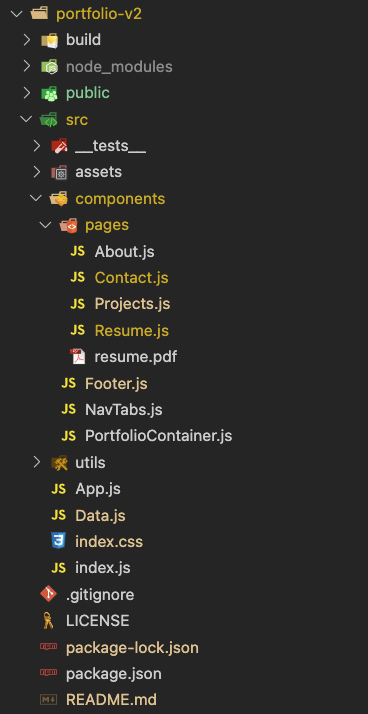
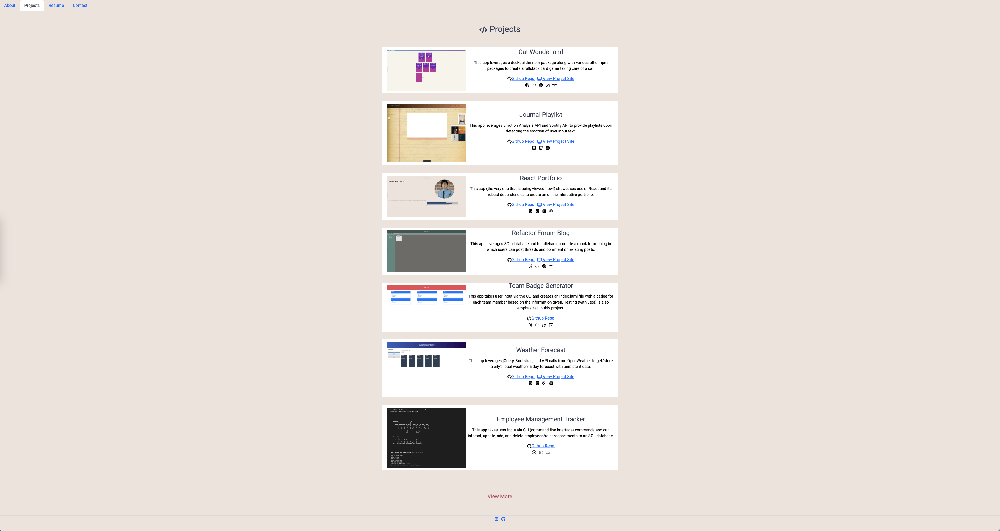

# React Portfolio

[](https://opensource.org/licenses/MIT)


## Description
This app showcases use of React and its robust ecosystem to create an online interactive portfolio.

## Technologies
This app was bootstrapped with [Create React App](https://github.com/facebook/create-react-app) (v17.0.2). It also uses [Bootstrap](https://github.com/twbs/bootstrap) (v5.2.3), [GH-Pages](https://github.com/tschaub/gh-pages) (v4.0.0), [React-Icons](https://github.com/react-icons/react-icons) (v.4.7.1), [React-tooltip](https://github.com/ReactTooltip/react-tooltip) (v4.5.1), [React-pdf](https://github.com/wojtekmaj/react-pdf) (v5.4.0), [React-typewriter-animate](https://github.com/doanhtu07/react-typewriter-animate) (v1.2.3), and [styled-components](https://github.com/styled-components/styled-components) (v5.3.6)


## Table of Contents
  - [Installation](#installation)
  - [Usage](#usage)
  - [Architecture](#architecture)
  - [Livesite](#livesite)
  - [Screenshot](#screenshot)
  - [Improvements](#improvements)
  - [Thoughts](#thoughts)
  - [License](#license)
  - [Questions](#questions)

## Installation

Upon cloning the github repository, the user should run the following command

```
npm install
```
The user should have the following dependencies within the package.json on root level:

```
...
   "dependencies": {
      "@testing-library/jest-dom": "^5.16.4",
      "@testing-library/react": "^11.1.0",
      "@testing-library/user-event": "^13.5.0",
      "bootstrap": "^5.2.3",
      "gh-pages": "^4.0.0",
      "react": "17.0.2",
      "react-bootstrap": "^2.6.0",
      "react-dom": "17.0.2",
      "react-icons": "^4.7.1",
      "react-pdf": "5.4.0",
      "react-scripts": "5.0.1",
      "react-tooltip": "^4.5.1",
      "react-typewriter-animate": "^1.2.3",
      "styled-components": "^5.3.6",
      "web-vitals": "^2.1.4"
  },
```

## Usage
After having run the ```npm install``` command, the user should run the following command while still at the root level:
```
npm run start
```

The user can now navigate to the url http://localhost:3000/ although the ap should launch itself after compiling successfully.

## Architecture
For this app, the following image shows the file architecture:


The src folder contains the components folder with a subfolder pages, a NavTabs header, PortfolioContainer to house the main page content, and a Footer.

## Livesite
[Deployed on Github Pages](https://richardjhong.github.io/portfolio-v2/#about)

## Screenshot


## Improvements
Admittedly I worked on the About Page and Projects page much more compared to Resume and Contact pages; as such I'd like to continue to build out the latter two which remain fairly barebones. I'd also like to introduce more animations e.g. animation when changing pages and possibly when scrolling. I'd also like to refactor the styling throughout the project which is a mix of an imported css file, inline styling, and styled-components. Lastly I'd like to look a bit more into choice of color theme and combinations. 

## Thoughts
I'm still ambivalent about styled-components ultimately; I do like that there's no friction between extracting the styling and components itself which leads to an environment conducive of rapid development and quick affirmation of style choices. At the same time, I do understand that this could quickly lead to files becoming "bloated" with length and possible redundancy of styling that can be better solved with a style guide and style sheet/CSS file.

I also had trouble with React-pdf working as expected when deployed on GitHub. After noticing that the browser console was showing that "required" was not defined, I quickly learned that this was an existing tracked issue within the dependency's Github [Issues](https://github.com/wojtekmaj/react-pdf/issues/782). I was able to finally fix the issue by downgrading to a more stable version of React-pdf and changing its import from using Webpack 5 to Webpack 4. While this whole endeavor was definitely frustrating and almost lead to my extracting the dependency altogher/settling for a broken implementation outside of the local environment, I'm glad to have the experience of troubleshooting within a Github issues page and recognizing what to look for in dependencies in the future.

## License
This app was licensed under the MIT License.

## Questions
Questions, comments, concerns? Send me an email at rhong24@gmail.com.


